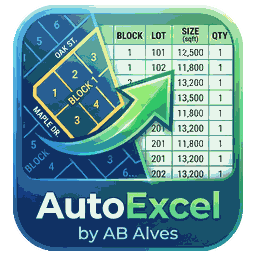

<div align="center">



# AutoExcel by AB Alves

### DXF → Excel, de forma automática, local e precisa.

O **AutoExcel by AB Alves** é um aplicativo desktop para Windows desenvolvido para automatizar a leitura de projetos de loteamentos em **DXF**, identificar **quadras, lotes e áreas** e gerar uma **planilha Excel formatada e pronta para uso**.

[](https://github.com/brunoalves-io/AutoExcel/releases/latest)


[**Baixar versão mais recente**](https://github.com/brunoalves-io/AutoExcel/releases/latest)

</div>

---

## Sobre o AutoExcel

Transformar dados de um projeto CAD em uma planilha organizada pode exigir conferência manual de dezenas ou centenas de lotes.

O AutoExcel automatiza esse fluxo.

Ele lê diretamente o arquivo **DXF**, interpreta a geometria do projeto, associa os dados de **quadra, lote e área**, valida a numeração e gera automaticamente o arquivo Excel no padrão do sistema.

Tudo é processado **localmente no computador**.

> Nenhum arquivo DXF é enviado para servidores externos.

---

## Principais recursos

- **Leitura direta de DXF**
- **Detecção automática de múltiplas quadras**
- **Identificação de lotes e respectivas áreas**
- **Associação geométrica entre lote, área e quadra**
- **Validação da numeração contínua dos lotes**
- **Recuperação de casos especiais pela geometria do DXF**
- **Agrupamento de áreas iguais consecutivas**
- **Geração automática de Excel formatado**
- **Totais por quadra**
- **Processamento 100% local**
- **Interface desktop para Windows**
- **Executável único, sem necessidade de instalar Python ou bibliotecas**

---

## Como funciona

```text
Arquivo DXF do AutoCAD
        │
        ▼
Leitura da geometria
        │
        ▼
Identificação de quadras
        │
        ▼
Associação lote + área
        │
        ▼
Validação da numeração
        │
        ▼
Organização dos dados
        │
        ▼
Planilha Excel pronta
```

O objetivo é reduzir tarefas repetitivas e transformar o desenho técnico em dados estruturados com poucos cliques.

---

## Planilha gerada

O AutoExcel organiza todas as quadras em uma única planilha, uma abaixo da outra.

Para cada quadra, o arquivo contém:

| Informação | Descrição |
|---|---|
| **Lotes** | Numeração individual ou intervalo de lotes |
| **Quantidade** | Quantidade de lotes no grupo |
| **Área unitária** | Área de cada lote |
| **Somatório** | Área total do grupo |
| **Total** | Quantidade e área total da quadra |

Lotes consecutivos com a mesma área podem ser agrupados automaticamente para deixar a planilha mais compacta e legível.

---

## Download

O AutoExcel é distribuído como **um único executável para Windows**.

Não é necessário:

- instalar Python;
- instalar bibliotecas;
- usar `pip`;
- configurar ambiente virtual;
- baixar dependências adicionais;
- extrair arquivos ZIP.

### Instalação

1. Acesse **Releases**.
2. Baixe o arquivo `AutoExcel-by-AB-Alves-vX.X.X.exe`.
3. Execute o programa.
4. Selecione seu arquivo DXF.
5. Gere o Excel.

➡️ **[Baixar AutoExcel](https://github.com/brunoalves-io/AutoExcel/releases/latest)**

---

## Tecnologias

O AutoExcel combina ferramentas Python especializadas em CAD, dados e geração de planilhas.

| Tecnologia | Uso |
|---|---|
| **Python** | Núcleo do aplicativo |
| **Streamlit** | Interface |
| **pywebview** | Janela desktop nativa |
| **ezdxf** | Leitura e interpretação de DXF |
| **pandas** | Organização dos dados |
| **openpyxl** | Criação e formatação do Excel |
| **PyInstaller** | Geração do executável standalone |
| **GitHub Actions** | Build, teste e publicação automática |

---

## Estrutura do projeto

```text
AutoExcel/
│
├── .github/
│   └── workflows/
│       └── build-windows.yml
│
├── scripts/
│   └── build_windows.ps1
│
├── app.py
├── core.py
├── dxf_reader.py
├── desktop_launcher.py
├── app_icon.png
├── requirements.txt
├── RELEASE_VERSION
├── README.md
└── .gitignore
```

### Arquivos principais

- `app.py` — interface e fluxo principal.
- `dxf_reader.py` — leitura, interpretação geométrica e tratamento dos DXFs.
- `core.py` — validação, organização dos dados e geração do Excel.
- `desktop_launcher.py` — inicialização da aplicação desktop e do servidor interno.
- `scripts/build_windows.ps1` — geração do executável standalone.
- `.github/workflows/build-windows.yml` — automação de build, testes e publicação.
- `RELEASE_VERSION` — controla a versão publicada.

---

## Build automático

O projeto utiliza **GitHub Actions** para gerar o executável Windows.

Quando uma nova versão é definida em `RELEASE_VERSION`, o pipeline:

```text
Código-fonte
    ↓
Instala dependências
    ↓
Prepara interface
    ↓
Gera ícone Windows
    ↓
Compila com PyInstaller
    ↓
Verifica o executável
    ↓
Executa smoke test
    ↓
Publica a Release
```

O resultado é um único arquivo `.exe` pronto para distribuição.

---

## Privacidade

O AutoExcel foi pensado para trabalhar com arquivos de projeto sem depender de serviços externos.

- O DXF é processado localmente.
- Não há upload do projeto para uma nuvem do AutoExcel.
- Não é necessária API de IA.
- A geração do Excel também acontece no próprio computador.

---

## Status

O AutoExcel está em desenvolvimento ativo.

As versões estáveis são publicadas na seção **Releases** deste repositório.

[](https://github.com/brunoalves-io/AutoExcel/releases/latest)
[](https://github.com/brunoalves-io/AutoExcel/actions)

---

## Autor

**AB Alves**

Desenvolvido para automatizar a transformação de projetos de loteamentos em dados organizados e prontos para Excel.

---

<div align="center">

**AutoExcel by AB Alves**  
*DXF in. Excel out.*

</div>
